<!-- markdownlint-disable MD024 MD013 MD004 -->
<!-- Disabled MD024 (Multiple headings with the same content) rule
because repeated headings are
intentionally used across multiple sections for structural clarity.
Disabled MD013 (Line length) rule because technical content require longer lines for readability. 
Disabled MD004 (unordered list style) to allow consistent usage of mixed list markers in the document. -->
# **Open-Source vs. Commercial AI: Comparing Performance and Quality — Findings Summary**

This report summarizes a blinded, side-by-side evaluation comparing open-source and commercial AI models on eight Apollo‑11–themed tasks: summarization, paraphrasing, reasoning, and creative writing. Conducted between November 21 and December 3, 2025, the study collected 42 complete responses.

For each task, participants reviewed two anonymous outputs (Text A and Text B), indicated a preference, rated Accuracy, Clarity, Relevance, and Faithfulness, and could optionally guess which output belonged to which model family. The ground-truth mapping was hidden during the survey and used only in analysis.

Findings should be interpreted with attention to the sample composition and to uncertainty: “not sure” responses and cases where participants could not tell models apart are informative signals, suggesting convergence in perceived quality under blind conditions.

---

## **1\. Participant Background**

### **Nationality (n \= 42\)**

* Turkish: 20  
* Sudanese: 16  
* Egyptian: 2  
* Sudan: 2  
* Argentinian: 1  
* Italian: 1  
* Nigerian: 1  
* Prefer not to say: 1

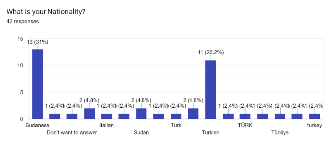

### **Native Language (n \= 42\)**

* Turkish: 20  
* Arabic: 19  
* English: 2  
* Spanish: 1

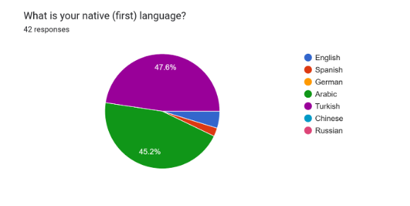

### **English Proficiency (n \= 42\)**

* C1 Advanced: 16  
* C2 Fluent: 11  
* B1–B2 Intermediate: 11  
* A1–A2 Basic: 2  
* Native: 2

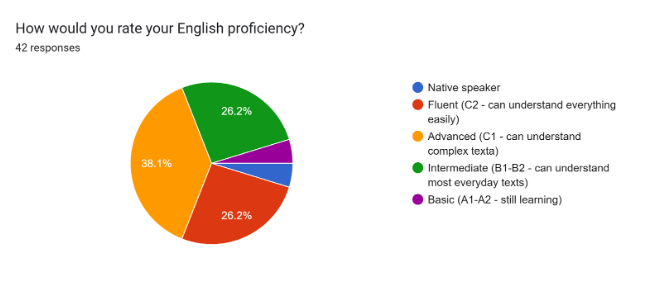

### **Occupation (n \= 42\)**

Varied professional backgrounds including Engineering (Civil, Electronic, Aeronautical), Teaching, Administration, Civil Society, Aircraft Maintenance, and Avionics.

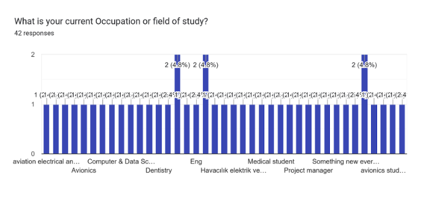

### **AI Usage Frequency (n \= 42\)**

* Daily: 21  
* Several times a week: 13  
* A few times a month: 4  
* Rarely: 2  
* Never: 1  
* Once a week: 1

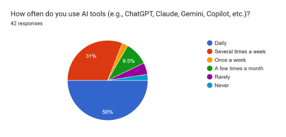

### **Primary Use Cases (total selections \= 154\)**

* Research & information gathering: 30  
* Learning & education: 26  
* Writing & editing: 21  
* Professional tasks: 14  
* Personal use/entertainment: 13  
* Coding/programming: 12  
* Translation/language learning: 11  
* Creative work (stories, art, brainstorming): 8  
  
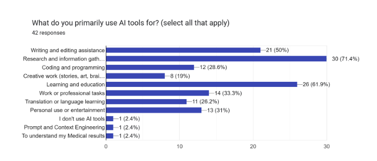  

### **Familiarity With Open-Source vs Commercial Models (n \= 42\)**

* Somewhat familiar: 12  
* Heard of it but don’t know details: 12  
* Very familiar: 11  
* Not familiar: 7

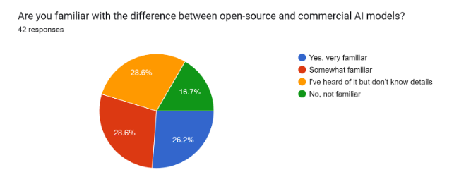  

### ➡️ Short Takeaways

- Dominant native languages are Turkish and Arabic; most participants have C1–C2 English proficiency.
- AI usage is frequent (daily/weekly), with top use cases in research, education, and writing assistance.
- Occupations skew technical, which may influence evaluations toward clarity and relevance in technically framed tasks.

---

## **2\. Task Prompts Overview**

## **Task 1.1 — Summarization**

Question: Summarize the main events during the Apollo 11 lunar landing in 3 sentences.

* Ground truth: Text A \= commercial, Text B \= open-source

### **Preferences**

* Text A preferred: 34 (81.0%)  
* Text B preferred: 7 (16.7%)  
* Not sure: 1 (2.4%)

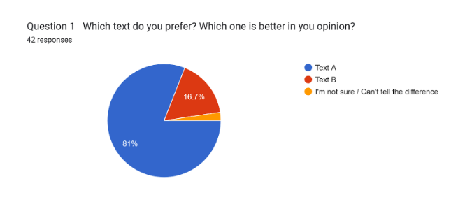

### **Identification (label distribution)**

* Text A is commercial model, Text B is open-source model: 21 (50.0%)  
* Text A is open-source model, Text B is commercial model: 10 (23.8%)  
* Both are commercial models: 1 (2.4%)  
* Both are open-source models: 3 (7.1%)  
* I'm not sure: 7 (16.7%)

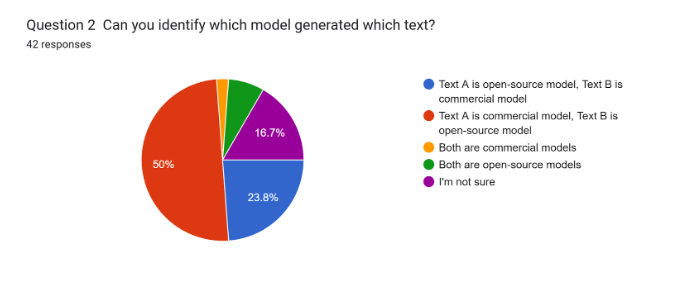

### **Identification correctness (vs ground truth)**

* Correct: 21 (50.0%)  
* Incorrect: 14 (33.3%)  
* Not sure: 7 (16.7%)

### **Ratings — Text A**

* Accuracy: mean 3.45, median 4.0, std 1.07, n 42  
* Clarity: mean 3.6, median 4.0, std 1.0, n 42  
* Relevance: mean 3.4, median 4.0, std 1.05, n 42  
* Faithfulness: mean 3.45, median 4.0, std 1.03, n 42

### 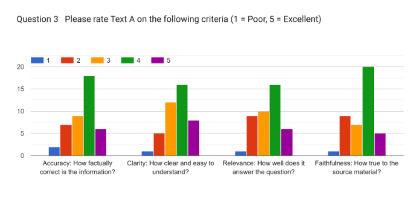

### **Ratings — Text B**

* Accuracy: mean 2.83, median 3.0, std 1.07, n 42  
* Clarity: mean 3.02, median 3.0, std 1.14, n 42  
* Relevance: mean 2.33, median 2.0, std 0.92, n 42  
* Faithfulness: mean 2.71, median 3.0, std 1.03, n 42

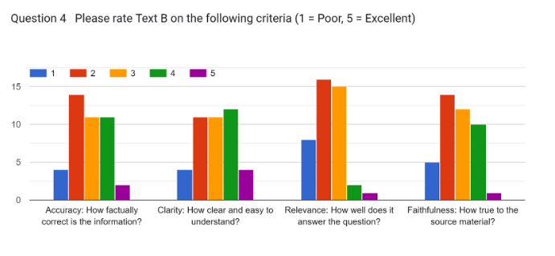

### ➡️ Short Takeaways

- The commercial model (Text A) was strongly preferred and scored higher across metrics.
- About half of participants correctly identified model types; the rest showed notable confusion.

## **Task 1.2 — Summarization**

Question: Explain what scientific equipment the astronauts deployed on the Moon.

* Ground truth: Text A \= commercial, Text B \= open-source

### **Preferences**

* Text A preferred: 33 (78.6%)  
* Text B preferred: 8 (19.0%)  
* Not sure: 1 (2.4%)

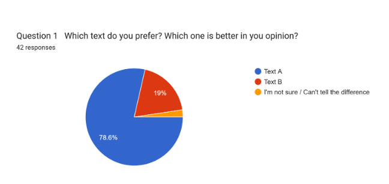

### **Identification (label distribution)**

* Text A is commercial model, Text B is open-source model: 25 (59.5%)  
* Text A is open-source model, Text B is commercial model: 10 (23.8%)  
* Both are commercial models: 1 (2.4%)  
* Both are open-source models: 2 (4.8%)  
* I'm not sure: 4 (9.5%)

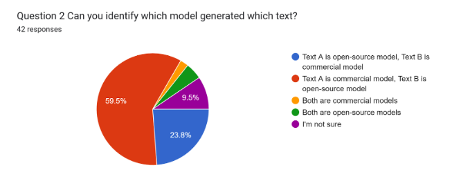

### **Identification correctness (vs ground truth)**

* Correct: 25 (59.5%)  
* Incorrect: 13 (31.0%)  
* Not sure: 4 (9.5%)

### **Ratings — Text A**

* Accuracy: mean 3.45, median 3.5, std 1.16, n 42  
* Clarity: mean 3.79, median 4.0, std 1.15, n 42  
* Relevance: mean 3.67, median 4.0, std 1.17, n 42  
* Faithfulness: mean 3.43, median 4.0, std 1.09, n 42

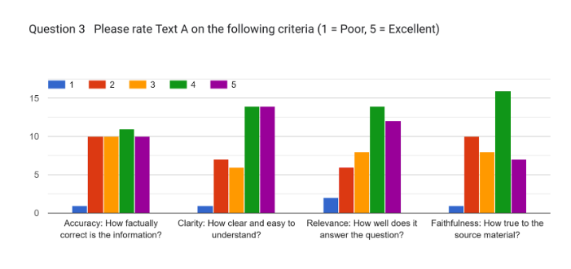

### **Ratings — Text B**

* Accuracy: mean 2.98, median 3.0, std 1.2, n 42  
* Clarity: mean 2.95, median 3.0, std 1.15, n 42  
* Relevance: mean 2.74, median 3.0, std 0.95, n 42  
* Faithfulness: mean 3.02, median 3.0, std 1.14, n 42

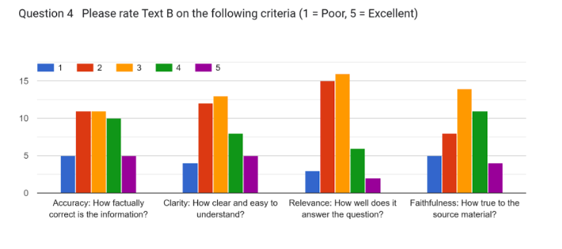

### ➡️ Short Takeaways

- For scientific equipment summarization, the commercial model again led clearly in preferences and ratings.
- Identification accuracy was higher than Task 1.1, suggesting more distinguishable content cues.

## **Task 2.1 — Paraphrasing**

Question: Explain how Armstrong’s decisions, actions, and teamwork during the descent contributed to the mission’s success.

* Ground truth: Text A \= open-source, Text B \= commercial

### **Preferences**

* Text A preferred: 15 (36.6%)  
* Text B preferred: 18 (43.9%)  
* Not sure: 8 (19.5%)

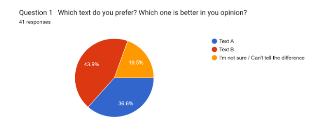

### **Identification (label distribution)**

* Text A is commercial model, Text B is open-source model: 20 (47.6%)  
* Text A is open-source model, Text B is commercial model: 10 (23.8%)  
* Both are commercial models: 3 (7.1%)  
* Both are open-source models: 3 (7.1%)  
* I'm not sure: 6 (14.3%)

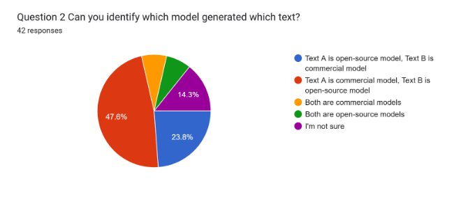

### **Identification correctness (vs ground truth)**

* Correct: 10 (23.8%)  
* Incorrect: 26 (61.9%)  
* Not sure: 6 (14.3%)

### **Ratings — Text A**

* Accuracy: mean 3.33, median 3.5, std 1.13, n 42  
* Clarity: mean 3.02, median 3.0, std 1.16, n 42  
* Relevance: mean 2.98, median 3.0, std 1.24, n 42  
* Faithfulness: mean 2.93, median 3.0, std 1.26, n 42

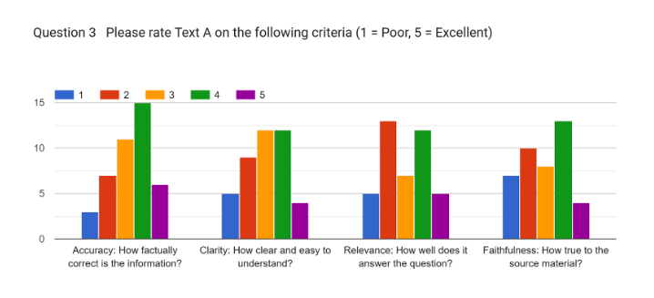

### **Ratings — Text B**

* Accuracy: mean 3.31, median 3.0, std 1.2, n 42  
* Clarity: mean 3.33, median 3.0, std 1.15, n 42  
* Relevance: mean 3.5, median 4.0, std 1.14, n 42  
* Faithfulness: mean 3.36, median 3.0, std 1.04, n 42

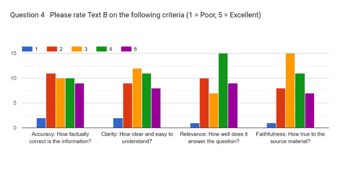

### ➡️ Short Takeaways

- In paraphrasing, the commercial model was slightly preferred and rated more relevant.
- Identification accuracy was low, implying stylistic and structural overlap between outputs.

## **Task 2.2 — Paraphrasing**

Question: In your own words, describe what happened when the computer alarms appeared during the landing.

* Ground truth: Text A \= open-source, Text B \= commercial

### **Preferences**

* Text A preferred: 13 (33.3%)  
* Text B preferred: 14 (35.9%)  
* Not sure: 12 (30.8%)

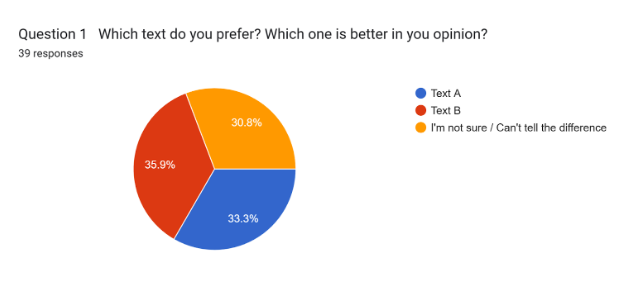

### **Identification (label distribution)**

* Text A is commercial model, Text B is open-source model: 11 (26.2%)  
* Text A is open-source model, Text B is commercial model: 11 (26.2%)  
* Both are commercial models: 4 (9.5%)  
* Both are open-source models: 5 (11.9%)  
* I'm not sure: 11 (26.2%)

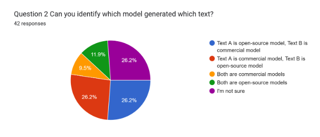

### **Identification correctness (vs ground truth)**

* Correct: 11 (26.2%)  
* Incorrect: 20 (47.6%)  
* Not sure: 11 (26.2%)

### **Ratings — Text A**

* Accuracy: mean 3.43, median 4.0, std 1.26, n 42  
* Clarity: mean 3.33, median 4.0, std 0.94, n 42  
* Relevance: mean 3.38, median 3.5, std 1.05, n 42  
* Faithfulness: mean 3.43, median 4.0, std 1.07, n 42

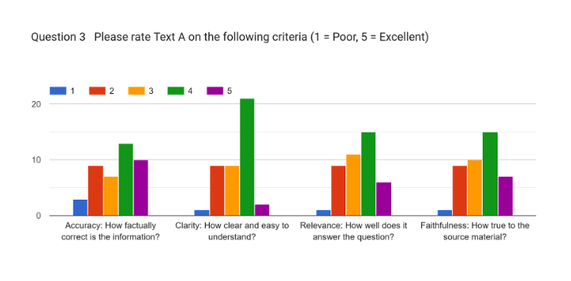

### **Ratings — Text B**

* Accuracy: mean 3.5, median 4.0, std 1.03, n 42  
* Clarity: mean 3.5, median 4.0, std 1.12, n 42  
* Relevance: mean 3.33, median 3.0, std 1.06, n 42  
* Faithfulness: mean 3.4, median 4.0, std 1.2, n 42

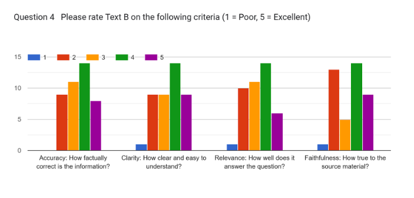

### ➡️ Short Takeaways

- Preferences are balanced; no clear winner. Open-source scored well on clarity, commercial slightly ahead on accuracy.
- Mixed identification suggests the outputs were perceived as stylistically similar.

## **Task 3.1 — Reasoning**

Question: Why did the computer alarms (1201 and 1202\) occur during the descent?

* Ground truth: Text A \= commercial, Text B \= open-source

### **Preferences**

* Text A preferred: 22 (52.4%)  
* Text B preferred: 17 (40.5%)  
* Not sure: 3 (7.1%)

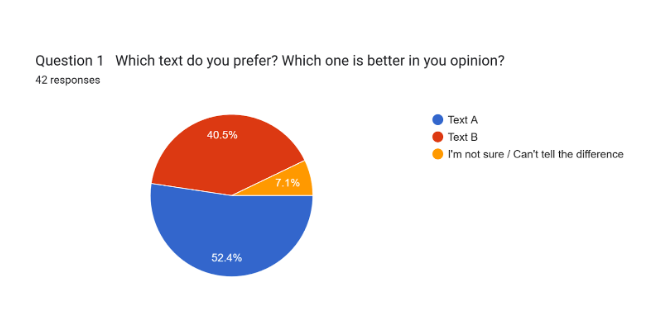

### **Identification (label distribution)**

* Text A is commercial model, Text B is open-source model: 19 (45.2%)  
* Text A is open-source model, Text B is commercial model: 8 (19.0%)  
* Both are commercial models: 4 (9.5%)  
* Both are open-source models: 5 (11.9%)  
* I'm not sure: 6 (14.3%)

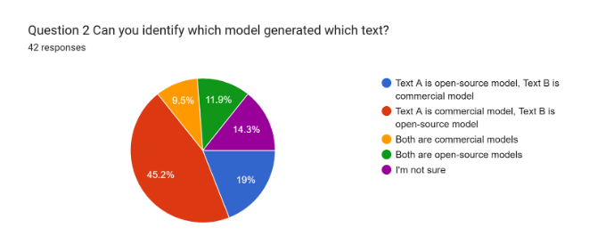

### **Identification correctness (vs ground truth)**

* Correct: 19 (45.2%)  
* Incorrect: 17 (40.5%)  
* Not sure: 6 (14.3%)

### **Ratings — Text A**

* Accuracy: mean 3.64, median 4.0, std 1.09, n 42  
* Clarity: mean 3.43, median 3.0, std 1.16, n 42  
* Relevance: mean 3.43, median 3.0, std 1.14, n 42  
* Faithfulness: mean 3.43, median 4.0, std 1.22, n 42

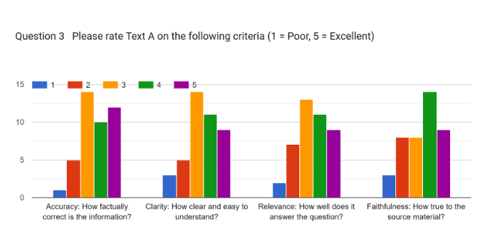

### **Ratings — Text B**

* Accuracy: mean 3.52, median 4.0, std 1.16, n 42  
* Clarity: mean 3.4, median 3.5, std 1.07, n 42  
* Relevance: mean 3.36, median 4.0, std 1.13, n 42  
* Faithfulness: mean 3.45, median 4.0, std 1.24, n 42

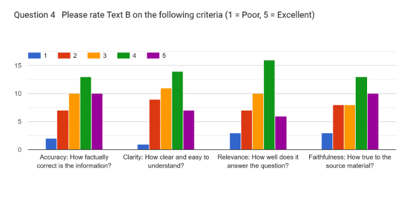

### ➡️ Short Takeaways

- For reasoning, the commercial model leads by a small margin, with strong accuracy and faithfulness.
- The open-source model remains competitive; differences are modest.

## **Task 3.2 — Reasoning**

Question: Based on the text, what does Margaret Hamilton's statement reveal about the Apollo Guidance Computer's design philosophy?

* Ground truth: Text A \= commercial, Text B \= open-source

### **Preferences**

* Text A preferred: 17 (40.5%)  
* Text B preferred: 12 (28.6%)  
* Not sure: 13 (31.0%)

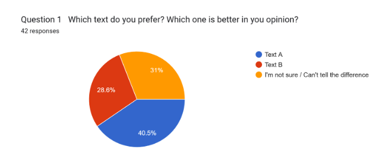

### **Identification (label distribution)**

* Text A is commercial model, Text B is open-source model: 9 (21.4%)  
* Text A is open-source model, Text B is commercial model: 14 (33.3%)  
* Both are commercial models: 3 (7.1%)  
* Both are open-source models: 3 (7.1%)  
* I'm not sure: 13 (31.0%)

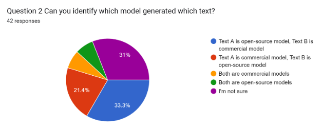

### **Identification correctness (vs ground truth)**

* Correct: 9 (21.4%)  
* Incorrect: 20 (47.6%)  
* Not sure: 13 (31.0%)

### **Ratings — Text A**

* Accuracy: mean 3.71, median 4.0, std 1.1, n 42  
* Clarity: mean 3.62, median 4.0, std 1.19, n 42  
* Relevance: mean 3.62, median 4.0, std 1.33, n 42  
* Faithfulness: mean 3.71, median 4.0, std 1.18, n 42

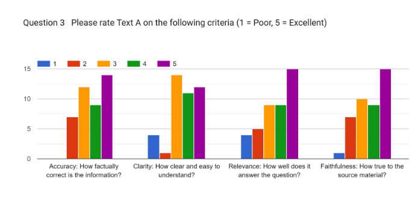

### **Ratings — Text B**

* Accuracy: mean 3.4, median 4.0, std 1.11, n 42  
* Clarity: mean 3.36, median 3.0, std 1.15, n 42  
* Relevance: mean 3.45, median 4.0, std 1.26, n 42  
* Faithfulness: mean 3.4, median 4.0, std 1.24, n 42

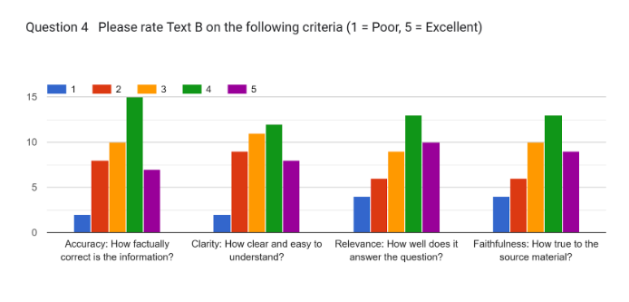

### ➡️ Short Takeaways

- On design philosophy interpretation, the commercial model scores higher, especially in accuracy and faithfulness.
- Identification uncertainty is high, indicating difficulty in distinguishing model types for abstract reasoning.

## **Task 4.1 — Creative Generation**

Question: Imagine being one of the people in Mission Control. How would you feel while watching the landing?

* Ground truth: Text A \= open-source, Text B \= commercial

### **Preferences**

* Text A preferred: 17 (40.5%)  
* Text B preferred: 14 (33.3%)  
* Not sure: 11 (26.2%)

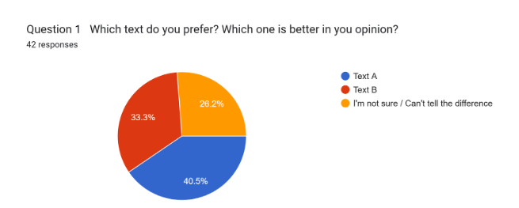

### **Identification (label distribution)**

* Text A is commercial model, Text B is open-source model: 16 (38.1%)  
* Text A is open-source model, Text B is commercial model: 10 (23.8%)  
* Both are commercial models: 3 (7.1%)  
* Both are open-source models: 3 (7.1%)  
* I'm not sure: 10 (23.8%)

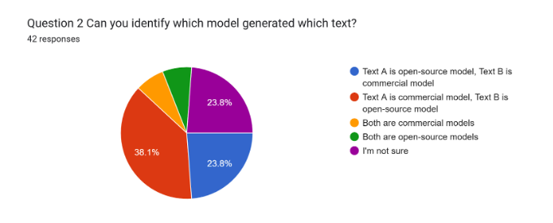

### **Identification correctness (vs ground truth)**

* Correct: 10 (23.8%)  
* Incorrect: 22 (52.4%)  
* Not sure: 10 (23.8%)

### **Ratings — Text A**

* Accuracy: mean 3.45, median 4.0, std 1.26, n 42  
* Clarity: mean 3.5, median 4.0, std 1.24, n 42  
* Relevance: mean 3.6, median 4.0, std 1.24, n 42  
* Faithfulness: mean 3.52, median 3.0, std 1.12, n 42

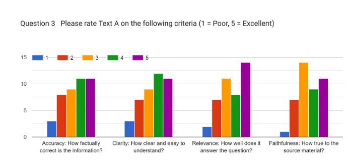

### **Ratings — Text B**

* Accuracy: mean 3.48, median 3.5, std 1.16, n 42  
* Clarity: mean 3.48, median 3.0, std 1.05, n 42  
* Relevance: mean 3.45, median 3.0, std 1.16, n 42  
* Faithfulness: mean 3.5, median 3.5, std 1.12, n 42

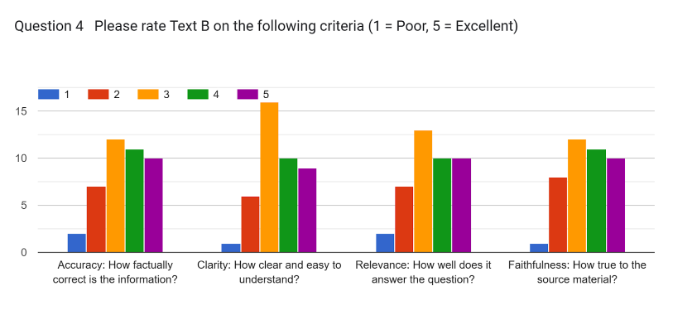

### ➡️ Short Takeaways

- In creative writing, open-source was slightly more preferred; overall scores are close across models.
- Low identification accuracy suggests creative tasks make model differences less salient.

## **Task 4.2 — Creative Generation**

Question: Write a short paragraph about what the Moon landing might have shown about human courage.

* Ground truth: Text A \= open-source, Text B \= commercial

### **Preferences**

* Text A preferred: 15 (37.5%)  
* Text B preferred: 15 (37.5%)  
* Not sure: 10 (25.0%)

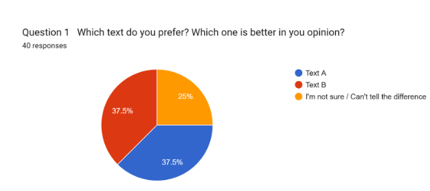

### **Identification (label distribution)**

* Text A is commercial model, Text B is open-source model: 13 (31.0%)  
* Text A is open-source model, Text B is commercial model: 8 (19.0%)  
* Both are commercial models: 3 (7.1%)  
* Both are open-source models: 2 (4.8%)  
* I'm not sure: 16 (38.1%)

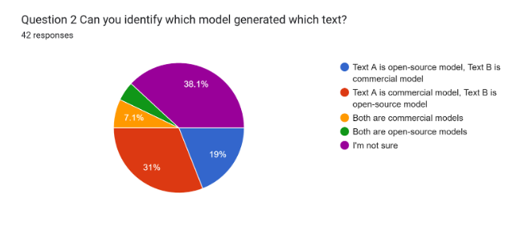

### **Identification correctness (vs ground truth)**

* Correct: 8 (19.0%)  
* Incorrect: 18 (42.9%)  
* Not sure: 16 (38.1%)

### **Ratings — Text A**

* Accuracy: mean 3.5, median 4.0, std 1.2, n 42  
* Clarity: mean 3.48, median 4.0, std 1.24, n 42  
* Relevance: mean 3.31, median 3.5, std 1.24, n 42  
* Faithfulness: mean 3.36, median 3.5, std 1.32, n 42

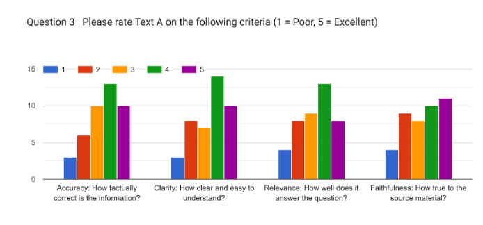

### **Ratings — Text B**

* Accuracy: mean 3.4, median 3.0, std 1.22, n 42  
* Clarity: mean 3.5, median 4.0, std 1.14, n 42  
* Relevance: mean 3.38, median 3.5, std 1.17, n 42  
* Faithfulness: mean 3.43, median 3.0, std 1.18, n 42

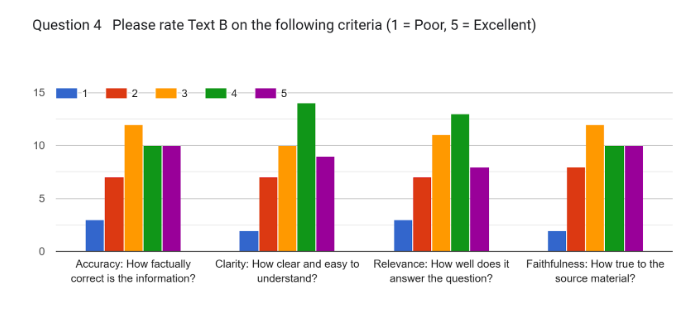  

### ➡️ Short Takeaways

- Preferences are perfectly balanced; creative quality appears comparable across models.
- High uncertainty in identification indicates model differences are subtle in creative outputs.

---

## **3\. General Feedback**

### Question 1: Did you notice any patterns or differences between the texts? (42 responses)

* Yes, clear patterns: 18 (38.1%)  
* Yes, minor differences: 17 (40.5%)  
* No, they seem similar: 6 (14.3%)
* Not sure: 7 (16.7%)

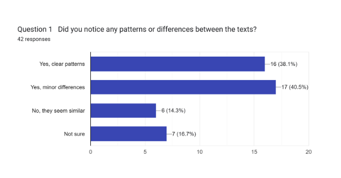

### ➡️ Short Takeaways

- Many respondents noticed differences, but a sizable group found the texts similar or were unsure. This suggests that the outputs often converge in perceived quality and style.
- The presence of uncertainty is informative: when distinctions aren’t obvious, it indicates that model identity is not easily detectable from outputs alone, which is useful for blind evaluations.

### Question 2: If yes, please describe what you noticed (optional) — 14 responses

Original comments included observations about punctuation, connector usage, level of detail, tone, expressiveness, and conciseness. Several participants mentioned that commercial models seemed more detailed or more human-like, sometimes even dramatic, while open-source outputs tended to be shorter or more robotic. Others found distinguishing the two increasingly difficult as they progressed through the survey. Some noted irrelevant outputs, task-dependent volatility, or descriptive differences. A few comments emphasized personal knowledge fluctuations, background expertise, or nostalgia from reading Apollo-related content. Participants also mentioned that some texts expressed personal opinions more than others, or displayed noticeably different descriptive depth.

### ➡️ Synthesis

Participants reported style and length differences, with commercial systems often producing longer or more detailed answers and open-source models providing more concise ones. Tone varied: some outputs felt robotic, others more expressive or dramatic. Importantly, several respondents highlighted difficulty in consistent differentiation, reinforcing that prompts and task type can blur distinctions. Perceived variability was also task-dependent, and occasional irrelevance or shifts in descriptive richness were noted.

### ➡️ Short Takeaways

- Not being able to reliably tell models apart is itself a positive signal for blind testing and fairness.
- Task framing and prompting likely influence perceived differences more than model category alone.

### Question 3: After completing this evaluation, do you think open-source AI models can compete with commercial models in terms of quality? (42 responses)

* Yes, they seem comparable: 9.5%  
* Mostly yes, with minor differences: 19%  
* Not sure / It depends on the task: 18%  
* No, commercial models are clearly noticeable: 45.2%  
* I couldn’t tell which was which: 9.5%

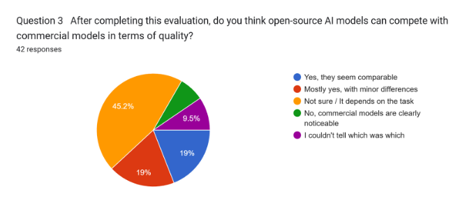

### ➡️ Short Takeaways

While many lean toward commercial models being stronger, a notable share finds open-source models competitive or emphasizes task dependence. The “not sure” and “couldn’t tell” responses indicate practical overlap in perceived quality—an important insight for real-world usage where model identity is hidden.

### Question 4: Additional comments or feedback about this study (optional) — 12 responses

Participants expressed that the survey was long and at times tiring, with some recommending a shorter format. Several were interested in receiving the results and discussions, and some said they now intend to try open-source tools. A number of comments pointed out that commercial models benefit from broader capabilities (e.g., video generation, image editing, multimodal tools), making open-source alternatives appear limited unless multiple models are combined. However, for text-based prompts, many felt open-source systems performed similarly, with user preference playing a large role.

Some respondents emphasized technical factors such as parameter count, quantization, precision, context window size, tokenizers, and training datasets, arguing that these should be considered in a fair comparison. Others noted that commercial models may lead in specialized or professional tasks, while open-source models are valuable for personal or transparent applications. Participants appreciated the clarity of the study and suggested including more complex or numerical prompts in future evaluations.

### ➡️ Synthesis

Several participants requested shorter surveys in the future and expressed strong interest in seeing the full results. Many highlighted that while commercial models offer more integrated capabilities, text-only performance across model categories can be comparable. Technical configuration details were seen as essential for fair comparisons. There was appreciation for the study's clarity and calls for more varied or complex prompts.

### ➡️ Short Takeaways

- Uncertainty and task dependence are central findings.
- Many participants found model quality comparable in text tasks, and model identity was not always obvious.
- Future studies should transparently document technical settings and consider shorter formats, varied task complexity, and more quantitative prompts.
