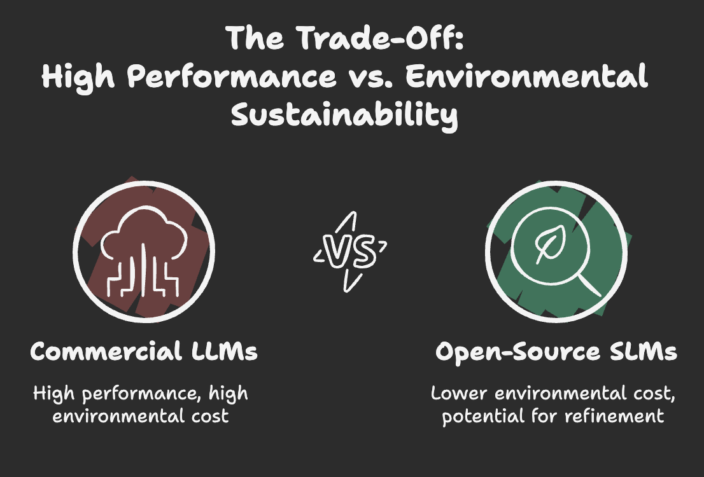
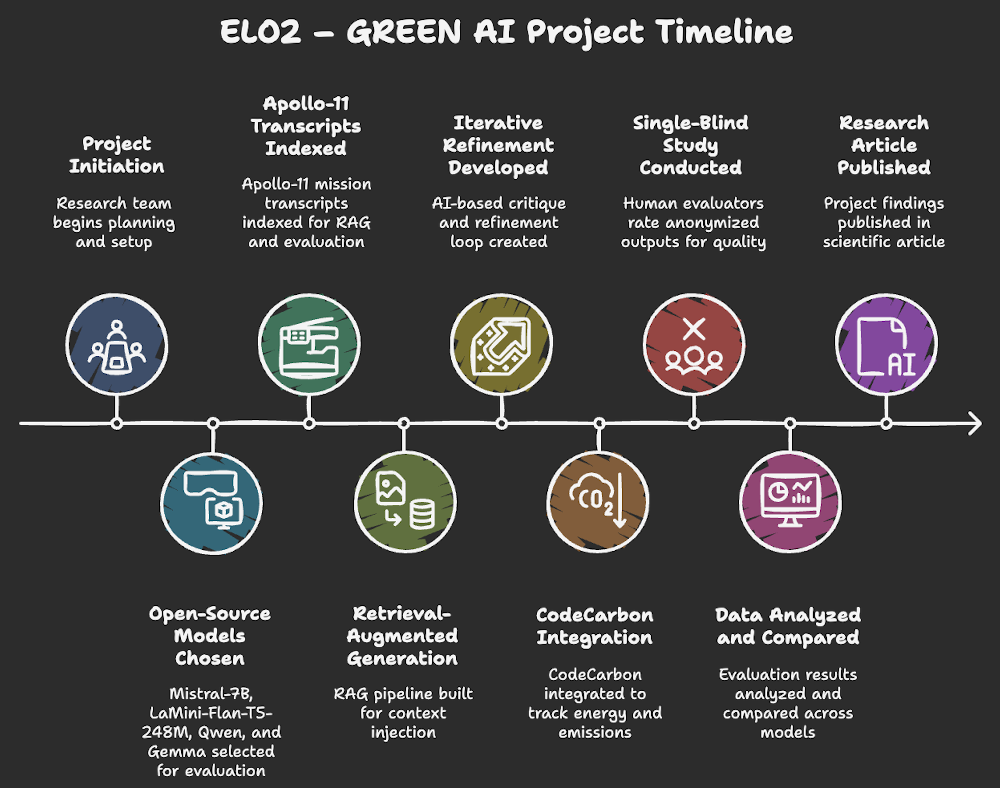
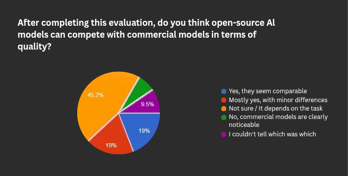

# 🌱 ELO2 – GREEN AI  

***Comparing Commercial and Open-Source Language Models for***
***Sustainable AI***

This repository presents the **ELO2 – GREEN AI Project**, developed
within the **MIT Emerging Talent – AI & ML Program (2025)**. The work
investigates the technical performance, sustainability traits, and
human-perceived quality of **open-source language models**
compared to commercial systems.

---

## 🔍 Project Overview

### Research Question

**To what extent can open-source LLMs provide competitive output quality
while operating at significantly lower environmental cost?**

### Motivation

Large commercial LLMs deliver strong performance but demand substantial
compute and energy. This project examines whether **small, accessible,
and environmentally efficient open-source models**—especially when
enhanced with retrieval and refinement pipelines—can offer practical
alternatives for everyday tasks.

---

## 🧪 Methods

### 1. Model Families

The study evaluates several open-source model groups:

- **Quantized Model:** Mistral-7B (GGUF)
- **Distilled Model:** LaMini-Flan-T5-248M
- **Small Models:** Qwen, Gemma
- **Enhanced Pipelines (applied to all model families):**
  - **RAG (Retrieval-Augmented Generation)**
  - **Recursive Editing**
    - includes AI-based critique and iterative refinement

These configurations serve as the optimized open-source setups used in
the comparison against commercial models.

### 2. Tasks & Dataset

Evaluation tasks include:

- summarization
- factual reasoning
- paraphrasing
- short creative writing
- instruction following
- question answering

A targeted excerpt from the **Apollo-11 mission transcripts** served as
the central reference text for all evaluation tasks. All prompts were constructed
directly from this shared material. Using a single, consistent source ensured
that every model was tested under identical informational conditions, allowing
clear and fair comparison of output quality and relevance.

### 3. RAG Pipeline

Retrieval-Augmented Generation (RAG) was applied to multiple model
families. The pipeline includes:

- document indexing  
- dense similarity retrieval  
- context injection through prompt augmentation  
- answer synthesis using guidance prompts  

RAG improved factual grounding in nearly all models.

### 4. Recursive Editing Framework

A lightweight iterative refinement procedure was implemented:

1. **Draft Generation:**  
   The primary model produces an initial output.

2. **AI-Based Critique:**  
   A secondary SLM evaluates clarity, accuracy, faithfulness and relevance.

3. **Refinement Step:**  
   A revision prompt integrates critique and generates an improved text.

4. **Stopping Condition:**  
   The cycle ends after a fixed number of iterations or when critique
   stabilizes.

This approach allowed weaker SLMs to yield higher-quality results
without relying on large models.

### 5. Environmental Measurement

Environmental footprint data was captured with **CodeCarbon**, recording:

- CPU/GPU energy usage
- Carbon emissions
- PUE-adjusted overhead

These measurements enabled comparison with published metrics for
commercial LLMs.

### 6. Human Evaluation (Single-Blind)

A structured Google Form experiment collected:

- **source identification** (commercial vs. open-source)  
- **quality ratings** on accuracy, faithfulness, relevance, and clarity  
  (1–5 scale)

Outputs were randomized and anonymized to avoid bias. This provided a
perception-based counterpart to technical evaluation.

### 7. Analysing the Results

....

### 8. Publishing an Article

....

---

## 📊 Key Findings

- Through our work and experiments, we were able to raise an important question and
demonstrate that open-source models, when carefully optimized, have significant
untapped potential
and with the right tweaks, they can meaningfully compete with commercial LLMs.

- The results show a promising trend: nearly 40% of respondents felt that open-
source models are either
fully comparable or only slightly behind commercial systems. Meanwhile, 45.2%
indicated that performance
differences depend on the specific task suggesting that open-source models can
match commercial quality in many real-world scenarios. Only a small minority felt
that commercial models were clearly superior. These findings reinforce our conclusion
that, with the right optimizations and configurations, open-source models have the
potential to compete meaningfully with commercial AI systems.

  

---

## 🔮 Future Work

- Evaluate additional open-source model families across diverse tasks
- Test optimized pipelines in specialized domains (medical, legal, technical writing)
- Track carbon footprint across full lifecycle (training to deployment)
- Conduct ablation studies isolating RAG vs. recursive editing contributions

---

## 📢 Communication Strategy

The research findings will be shared through formats designed for different
audiences and purposes:

### For Researchers

A comprehensive research article will document the complete experimental design,
statistical analysis, and implications.

🔗 **[View Aticle](link1)**

### For Practitioners & Educators

An executive presentation provides a visual overview of the research question,
methodology, and key findings without requiring deep technical background.

🔗 **[View Presentation](link2)**

### For the Community

A public evaluation study invites participation in assessing AI-generated texts.
This crowdsourced data forms a critical component of the research.

🔗 **[Participate in Study](link3)**

### For Reproducibility

All materials (dataset, prompts, model outputs, evaluation scripts, and carbon
tracking logs) are publicly available in this repository.

🔗 **[Browse Repository](https://github.com/banuozyilmaz2-jpg/ELO2-GREEN-AI)**

---

## 👥 Contributors

- [Amro Mohamed](https://github.com/Elshikh-Amro)
- [Aseel Omer](https://github.com/AseelOmer)
- [Banu Ozyilmaz](https://github.com/doctorbanu)
- [Caesar Ghazi](https://github.com/CaesarGhazi)
- [Reem Osama](https://github.com/reunicorn1)
- [Safia Gibril Nouman](https://github.com/Safi222)

---

## 🙏 Acknowledgments

Special thanks to the **MIT Emerging Talent Program** for their guidance and
feedback throughout the project.
